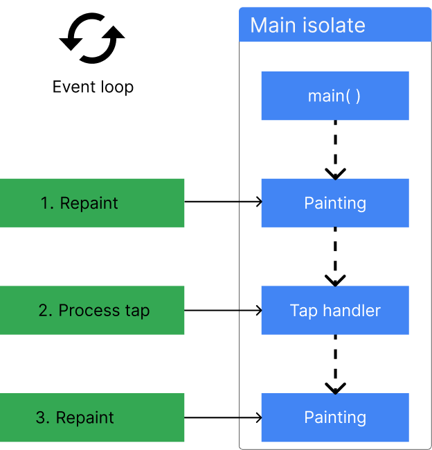

## sync vs async

```dart
void main() {
  print('Bắt đầu');
  Future.delayed(Duration(seconds: 2));
  print('Kết thúc');
}

void main() {
    print('Bắt đầu');
    sleep(Duration(seconds: 2));
    print('Kết thúc');
}
```

## Event Loop


-   `Event Loop` (Vòng lặp sự kiện) là một cơ chế cốt lõi trong Dart, đóng vai trò điều phối việc thực thi các tác vụ đồng bộ và bất đồng bộ trong ứng dụng. Nó hoạt động như một vòng lặp vô tận, liên tục kiểm tra và xử lý các sự kiện từ hai hàng đợi:
    -   `Microtask queue`: Chứa các tác vụ vi mô được tạo ra từ các thao tác bất đồng bộ bên trong Dart, ví dụ như `await` bên trong `async` function.
    -   `Event queue`: Chứa các sự kiện từ bên ngoài, ví dụ như các sự kiện từ người dùng, hoặc các sự kiện từ hệ thống.
-   Cách thức hoạt động:

-   `Event Loop` luôn ưu tiên xử lý các `microtask` trong `microtask` queue trước.
-   Sau khi xử lý hết tất cả các `microtask`, `Event Loop` sẽ chuyển sang xử lý các sự kiện trong `event queue`.
-   Khi xử lý một sự kiện, `Event Loop` sẽ chờ cho đến khi sự kiện đó được xử lý xong, sau đó nó sẽ quay lại kiểm tra xem có `microtask` nào trong `microtask queue` không.
-   Nếu có, `Event Loop` sẽ xử lý tiếp `microtask` đó, nếu không, nó sẽ chuyển sang xử lý sự kiện tiếp theo trong `event queue`.
-   `Event Loop` sẽ tiếp tục lặp lại quá trình trên cho đến khi cả hai hàng đợi đều rỗng.

-   Look like:

```dart

while (eventQueue.waitForEvent()) {
  eventQueue.processNextEvent();
}

```

-   For example, a client application might need to execute an HTTP request, while also listening for a user to tap a button. To handle this, Dart offers many async APIs, like `Futures`, `Streams`, and `async-await`. These APIs are built around this event loop.

```dart
http.get('https://example.com').then((response) {
  if (response.statusCode == 200) {
    print('Success!')'
  }
}
```

-   Trong ví dụ trên, `http.get` trả về một `Future`, nó sẽ được thêm vào `microtask queue`. Khi `http.get` hoàn thành, `Event Loop` sẽ chuyển sang xử lý `then` callback, nó sẽ được thêm vào `microtask queue` và được xử lý sau khi `http.get` hoàn thành.


.png>)

## Asynchronous programming

-   `Future` là một cơ chế trong Dart để xử lý các tác vụ bất đồng bộ. Một `Future` đại diện cho một giá trị hoặc một lỗi mà sẽ được trả về trong tương lai.
-   Hơi giống với `Promise` trong JavaScript, `Future` cung cấp một cách để xử lý các tác vụ bất đồng bộ mà không cần sử dụng callback.

```dart
Future<String> _readFileAsync(String filename) {
  final file = File(filename);

  // .readAsString() returns a Future.
  // .then() registers a callback to be executed when `readAsString` resolves.
  return file.readAsString().then((contents) {
    return contents.trim();
  });
}

void main() {
  _readFileAsync('file.txt').then((content) {
    print(content);
  });
}
```

## Streams

-   `Stream` là một chuỗi các giá trị được phát ra theo thời gian. Một `Stream` có thể phát ra các giá trị đơn hoặc một chuỗi các giá trị.
-   `Stream` cung cấp một cơ chế để xử lý các sự kiện liên tục, như các sự kiện từ người dùng, hoặc các sự kiện từ hệ thống.
-   `Stream` cung cấp một cách để xử lý các sự kiện một cách tuần tự, không đồng thời.

```dart
void main() {
  final stream = Stream.fromIterable([1, 2, 3, 4, 5]);

  stream.listen((value) {
    print(value);
  });
}
```

## Isolates

-   `Isolate` là một cơ chế trong Dart để xử lý các tác vụ đồng thời. Mỗi `Isolate` có một bộ nhớ riêng, không chia sẻ bộ nhớ với các `Isolate` khác.
-   `Isolate` cung cấp một cách để xử lý các tác vụ đồng thời mà không ảnh hưởng đến hiệu suất của ứng dụng.
-   Mỗi `Isolate` chạy trong một luồng riêng, không chia sẻ luồng với các `Isolate` khác. Chắc chắn rằng các `Isolate` không ảnh hưởng đến nhau.
-   `Isolate` không thể truy cập trực tiếp vào bộ nhớ của các `Isolate` khác, nhưng chúng có thể giao tiếp với nhau thông qua `SendPort` và `ReceivePort`.
-   `SendPort` là một cơ chế để gửi dữ liệu từ một `Isolate` đến một `Isolate` khác.
-   `ReceivePort` là một cơ chế để nhận dữ liệu từ một `Isolate`.

```dart
import 'dart:isolate';

void main() async {
  final receivePort = ReceivePort();

  await Isolate.spawn(_isolate, receivePort.sendPort);

  receivePort.listen((message) {
    print('Received: $message');
  });
}

void _isolate(SendPort sendPort) {
  sendPort.send('Hello from Isolate!');
}
```

-   The main isolate
    

## Background workers


## Using isolates

-   `Isolate.run` để chạy một hàm trong một `Isolate` mới.
-   `Isolate.spawn` để chạy một hàm trong một `Isolate` mới và trả về một `Isolate` instance.

# Note

-   `Isolate`:
    -   Ưu điểm:
        -   `Tách biệt bộ nhớ`: Mỗi `Isolate` có một bộ nhớ riêng, không chia sẻ bộ nhớ với các `Isolate` khác. Điều này giúp tránh xung đột dữ liệu giữa các `Isolate`.
        -   `Hiệu suất`: `Isolate` cung cấp một cách để xử lý các tác vụ đồng thời mà không ảnh hưởng đến hiệu suất của ứng dụng.
        -   `Giao tiếp`: `Isolate` không thể truy cập trực tiếp vào bộ nhớ của các `Isolate` khác, nhưng chúng có thể giao tiếp với nhau thông qua `SendPort` và `ReceivePort`.
    -   Nhược điểm:
        -   `Khó khăn trong việc giao tiếp`: `Isolate` không thể truy cập trực tiếp vào bộ nhớ của các `Isolate` khác, điều này có thể làm cho việc giao tiếp giữa các `Isolate` trở nên phức tạp hơn.
        -   `Khó khăn trong việc chia sẻ dữ liệu`: `Isolate` không chia sẻ bộ nhớ với các `Isolate` khác, điều này có thể làm cho việc chia sẻ dữ liệu giữa các `Isolate` trở nên phức tạp hơn.
-   `Async`:
    -   Ưu điểm:
        -   `Dễ sử dụng`: Async sử dụng cú pháp đơn giản và quen thuộc hơn so với `Isolate`.
        -   `Tiết kiệm bộ nhớ`: Async không tạo ra một bộ nhớ riêng cho mỗi tác vụ, điều này giúp tiết kiệm bộ nhớ hơn so với `Isolate`.
        -   `Giao tiếp dễ dàng`: Giao tiếp giữa các tác vụ Async có thể được thực hiện thông qua `Future` và `Stream`, đơn giản hơn so với `Isolate`.
    -   Nhược điểm:
        -   `Không tách biệt bộ nhớ`: Async không tách biệt bộ nhớ giữa các tác vụ, điều này có thể dẫn đến xung đột dữ liệu giữa các tác vụ.
        -   `Hiệu suất`: Async không thể chạy song song trên nhiều lõi `CPU` như `Isolate`, do đó hiệu suất có thể thấp hơn cho các tác vụ nặng.

# Summary

-   Sử dụng `Isolate` xử lý các tác vụ nặng such as:
    -   Xử lý dữ liệu lớn.
    -   Xử lý các tác vụ đồng thời.
    -   Xử lý các tác vụ đòi hỏi hiệu suất cao.
-   Sử dụng `Async` xử lý các tác vụ nhẹ như:
    -   Xử lý các tác vụ bất đồng bộ.
    -   Xử lý các sự kiện liên tục.
    -   Xử lý các tác vụ đơn giản.
    -   Networking
    -   File I/O
    -   Database I/O
    -   Image processing
    -   Audio processing
    -   Video processing
    -   Pla pla
