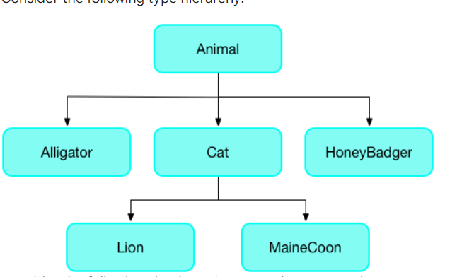

## Type System

-   [Type System](#type-system)
    -   [Type](#type)
    -   [Type Annotation](#type-annotation)
    -   [Type Inference](#type-inference)
    -   [Type Promotion](#type-promotion)
    -   [Type Checking](#type-checking)
    -   [Type Casting](#type-casting)
    -   [Type Conversion](#type-conversion)
    -   [Type Safety](#type-safety)
    -   [Type Alias](#type-alias)
    -   [Type Parameter](#type-parameter)
    -   [Type Argument](#type-argument)
    -   [Type Variable](#type-variable)
    -   [Type Bound](#type-bound)
    -   [Type Erasure](#type-erasure)
    -   [Type Reflection](#type-reflection)
    -   [Type Invariance](#type-invariance)
    -   [Type Covariance](#type-covariance)
    -   [Type Contravariance](#type-contravariance)
    -   [Type Variance](#type-variance)
    -   [Type Compatibility](#type-compatibility)
    -   [Type Equivalence](#type-equivalence)
    -   [Type Inequality](#type-inequality)
    -   [Type Unification](#type-unification)
    -   [Type Inference](#type-inference)
    -   [Type Annotation](#type-annotation)
    -   [Type Checking](#type-checking)
    -   [Type Casting](#type-casting)
    -   [Type Conversion](#type-conversion)
    -   [Type Safety](#type-safety)
    -   [Type Alias](#type-alias)
    -   [Type Parameter](#type-parameter)
    -   [Type Argument](#type-argument)
    -   [Type Variable](#type-variable)
    -   [Type Bound](#type-bound)
    -   [Type Erasure](#type-erasure)
    -   [Type Reflection](#type-reflection)
    -   [Type Invariance](#type-invariance)
    -   [Type Covariance](#type-covariance)
    -   [Type Contravariance](#type-contravariance)
    -   [Type Variance](#type-variance)
    -   [Type Compatibility](#type-compatibility)
    -   [Type Equivalence](#type-equivalence)
    -   [Type Inequality](#type-inequality)

## Simple Type Assignment

Code in here.
